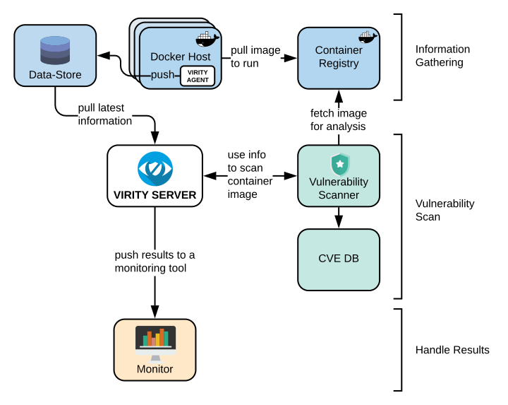

# Virity
[](https://goreportcard.com/report/github.com/car2go/virity)
[](https://github.com/car2go/virity/blob/master/LICENSE)
[](https://travis-ci.org/car2go/virity)


Virity is a tool which is built for making vulnerabilities of Docker containers visible. It connects monitoring tools like sensu or elasticseach with container scanning tools like clair or anchore. Virity is based on an Agent-Server architecture. The Virity-Agent runs on every Docker host or a Kubernetes cluster and fetches constantly all currently running containers. The Virity Server uses this information and automatically pushes the images, used in the containers, to the configurated scan engine. The scanning results are filtered by severity and then pushed to the chosen monitoring system.



## Install

Build agent and server (optional pass registry and version variable):

```bash
make VERSION=<version> REGISTRY=<registry>
```

## Run the agent

Run on every dockerhost:

```bash
docker run -d -h $(hostname)  --read-only --name virity-agent -v /var/run/docker.sock:/var/run/docker.sock <registry>/virity-agent:<version>
```

## Run the server

Run on one dockerhost:

```bash
docker run -d --name  --read-only virity-server <registry>/virity-server:<version>
```

## Configuration

Configuration can be done via environment variables.

```bash
export VIRITY_GENERAL_AGENTENV=k8s
export VIRITY_STORE_INTERVAL_AGENTPUSH=10m
```

[How to set environment variables in docker](https://docs.docker.com/engine/reference/commandline/run/#set-environment-variables--e---env---env-file)

All config variables can be found in the example config.yml file.
